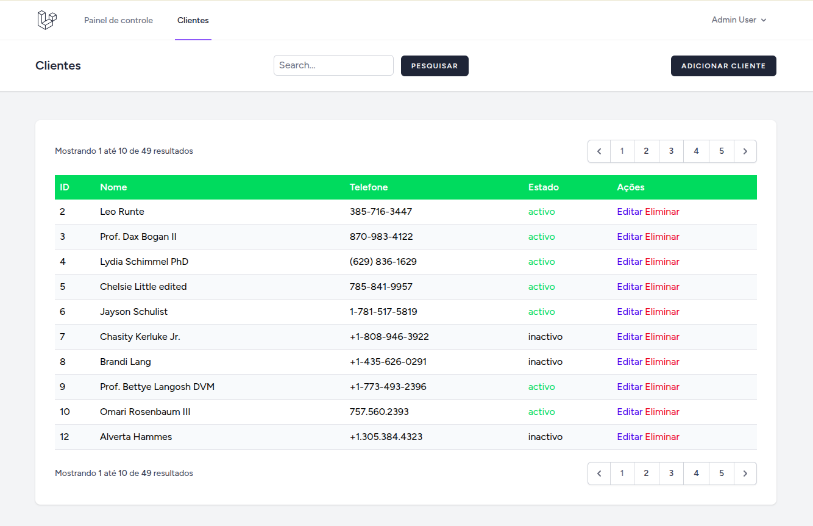

# Teste Laravel Grupo FAW
## Gestão de Clientes



## Como instalar e rodar o projeto?

Nota: Este projeto utiliza o Laravel Sail para rodar o ambiente de desenvolvimento com Docker.
Mas pode ser rodar outro ambiente como Wamp ou Xampp, desde que tenha o PHP 8.3+ e o Composer instalado.

### clone o repositório
```bash
git clone https://github.com/katalekoweb/teste-laravel-grupo-faw.git
cd teste-laravel-grupo-faw
```

### Copie o arquivo .env.example para .env 
```bash
cp .env.example .env
```

## Usando o docker com sail - pule esta seção se for usar ambiente local sem docker

### Instale as dependencias com o composer via docker
```bash
docker run --rm \
    -u "$(id -u):$(id -g)" \
    -v "$(pwd):/var/www/html" \
    -w /var/www/html \
    laravelsail/php84-composer:latest \
    composer install --ignore-platform-reqs
```

### Rode os conatiners com sail
```bash
./vendor/bin/sail up -d
```

### Gere a chave da aplicação Laravel
```bash
./vendor/bin/sail artisan key:generate
```

### Rode as migrations e seeders
```bash
./vendor/bin/sail artisan migrate --seed
```

### Instale as dependencias npm
```bash
./vendor/bin/sail npm i
```

### Compile as dependencias front-end
```bash
./vendor/bin/sail npm run build
```

## Usando ambiente local (Xampp, Wamp, etc)

### Instale as dependencias com o composer
```bash
composer install
```

### Gere a chave da aplicação Laravel
```bash
php artisan key:generate
```

### Configure o arquivo .env com as credenciais do seu banco de dados local

### Rode as migrations e seeders
```bash
php artisan migrate --seed
```

### Instale as dependencias npm
```bash
npm install
```

### Compile as dependencias front-end
```bash
npm run build
```

## Abra o projeto no navegador
http://localhost ou o link do seu ambiente local

## Clieque em login e utilize a seguinte credencial:
Login:   
username:admin@admin.com   
password: password

## Obs: O projeto já vem com alguns clientes cadastrados via seeder.